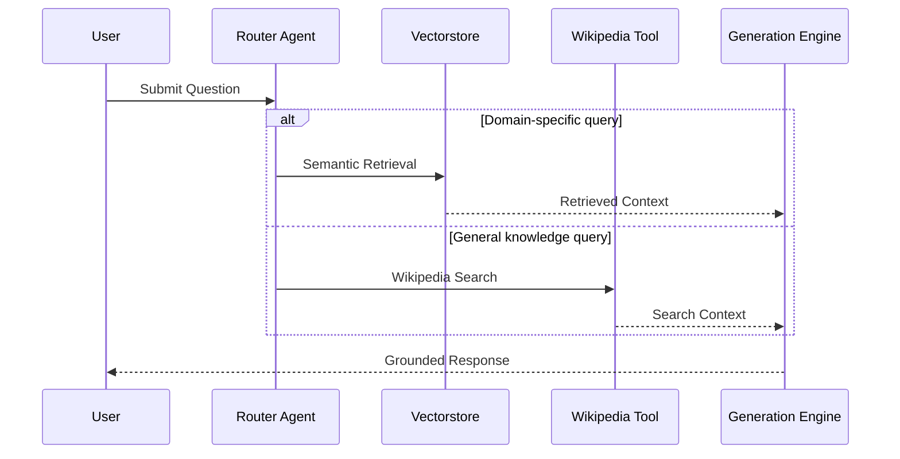

````md
# LangGraph Agentic Retrieval Engine

An agentic AI retrieval system that dynamically routes user intent between semantic vector retrieval and live knowledge search, then synthesizes grounded responses through a graph-orchestrated LLM workflow.

Built using LangGraph, LangChain, Groq, AstraDB/Cassandra, Streamlit, and HuggingFace embeddings to demonstrate production-oriented AI systems engineering patterns.

---

## Key Features

### 🔀 Intelligent Multi-Source Routing

Implements a structured routing engine that classifies incoming queries and dynamically selects between vectorstore retrieval or live Wikipedia search, reducing unnecessary retrieval overhead and improving contextual accuracy.

### 🧠 Graph-Orchestrated Agent Workflow

Uses a compiled LangGraph `StateGraph` to model retrieval and generation as deterministic execution nodes, enabling scalable multi-step AI orchestration instead of single-pass prompting.

### 📚 Semantic Vector Retrieval Pipeline

Builds a full ingestion pipeline that:

- loads live web documents,
- chunks content semantically,
- generates embeddings,
- and persists vectors into AstraDB/Cassandra for efficient similarity search.

### ⚡ Grounded LLM Generation

Combines retrieved context with constrained prompt engineering to generate context-aware responses while minimizing hallucinations through source-bounded generation.

### 🖥️ Interactive AI Interface

Provides a lightweight Streamlit interface for:

- runtime configuration,
- dynamic URL ingestion,
- session persistence,
- and conversational interaction without requiring a dedicated frontend stack.

---

## System Architecture

```mermaid
flowchart TD

    User[User Interface - Streamlit] --> Query[User Query]

    Query --> Graph[LangGraph StateGraph Engine]

    Graph --> Router[Structured Router Agent]

    Router -->|Domain-Specific Query| Retriever[Vectorstore Retriever]

    Router -->|General Knowledge Query| Wiki[Wikipedia Search Tool]

    Retriever --> Context[Context Assembly Layer]

    Wiki --> Context

    Context --> Generator[LLM Response Generator]

    Generator --> Response[Grounded AI Response]

    Response --> User


    subgraph Retrieval Infrastructure
        Loader[Web Document Loader]
        Splitter[Text Splitter]
        Embedder[HuggingFace Embeddings]
        VectorDB[AstraDB / Cassandra]
    end

    Loader --> Splitter
    Splitter --> Embedder
    Embedder --> VectorDB
    VectorDB --> Retriever
````

---

## Deep Dive — Engineering Challenges

### `graph.py` — Core Agent Orchestration Engine

The most technically complex module in the repository is `graph.py`, because it encapsulates the full execution lifecycle of the retrieval engine.

Unlike traditional LLM applications that follow a linear:

```text
Input → Prompt → Response
```

this system implements a conditional graph-based workflow:

```text
Input
  ↓
Routing
  ↓
Tool Selection
  ↓
Retrieval
  ↓
Context Assembly
  ↓
Grounded Generation
```

### Primary Engineering Challenges

#### 1. Deterministic Multi-Path Execution

The engine must dynamically decide whether a query should:

* retrieve from AstraDB,
* or invoke Wikipedia search.

This is solved using:

* structured LLM outputs,
* conditional LangGraph edges,
* and typed routing schemas.

---

#### 2. Stateful Context Propagation

Each graph node requires access to shared execution state:

* question,
* retrieved documents,
* source metadata,
* generated output.

The implementation uses a typed `GraphState` object to maintain deterministic state transitions across nodes.

---

#### 3. Context-Constrained Generation

The generation node synthesizes answers strictly from retrieved context rather than allowing unconstrained model generation.

This architecture:

* reduces hallucination risk,
* improves retrieval grounding,
* and mirrors real-world enterprise RAG pipelines.

---

#### 4. Modular Agent Design

Retrieval, routing, and generation are isolated into composable nodes, allowing future expansion into:

* hybrid retrieval,
* tool-calling agents,
* memory systems,
* reranking pipelines,
* or multi-agent execution.

---

## Tech Stack & Tools

| Category     | Technologies                                | Purpose                                   |
| ------------ | ------------------------------------------- | ----------------------------------------- |
| Core         | Python                                      | Primary application language              |
| Core         | LangGraph                                   | Stateful agent workflow orchestration     |
| Core         | LangChain                                   | Retrieval, prompts, and tool abstractions |
| Core         | Groq                                        | High-speed LLM inference                  |
| Core         | Streamlit                                   | Interactive frontend interface            |
| State/Data   | AstraDB                                     | Managed vector database                   |
| State/Data   | Apache Cassandra                            | Vector storage backend                    |
| State/Data   | HuggingFace Embeddings (`all-MiniLM-L6-v2`) | Semantic embedding generation             |
| State/Data   | Wikipedia API Wrapper                       | External live knowledge retrieval         |
| AI/ML        | Sentence Transformers                       | Embedding model infrastructure            |
| DevOps/Tools | Streamlit Runtime                           | Local development environment             |
| DevOps/Tools | `requirements.txt`                          | Dependency management                     |
| DevOps/Tools | Python Virtual Environment                  | Environment isolation                     |

---

## Repository Structure

```text
project/
│
├── app.py
├── agent.py
├── graph.py
├── router.py
├── vectorstore.py
├── wiki_tool.py
├── ui.py
└── requirements.txt
```

| File             | Responsibility                              |
| ---------------- | ------------------------------------------- |
| `app.py`         | Streamlit application entrypoint            |
| `agent.py`       | High-level system initialization            |
| `graph.py`       | LangGraph orchestration workflow            |
| `router.py`      | Query routing and structured classification |
| `vectorstore.py` | Ingestion, embeddings, and retrieval setup  |
| `wiki_tool.py`   | Wikipedia retrieval tool integration        |
| `ui.py`          | UI rendering and styling helpers            |

---

## Setup & Installation

### 1. Clone Repository

```bash
git clone <repository_url>
cd <repository_name>
```

---

### 2. Create Virtual Environment

```bash
python -m venv .venv
```

#### macOS / Linux

```bash
source .venv/bin/activate
```

#### Windows

```bash
.venv\Scripts\activate
```

---

### 3. Install Dependencies

```bash
pip install -r requirements.txt
```

---

### 4. Configure Credentials

You will need:

* Groq API Key
* AstraDB Token
* AstraDB Database ID

---

### 5. Run Application

```bash
streamlit run app.py
```

---

## Retrieval Workflow



---

## Future Roadmap

### 🔄 Hybrid Retrieval Fusion

Combine vector similarity retrieval with external search retrieval using confidence-weighted ranking and reranking pipelines.

### 🧠 Conversational Memory Engine

Introduce persistent short-term and long-term memory layers for contextual multi-turn conversations.

### 🚀 FastAPI + Mobile Integration

Refactor the runtime into a dedicated FastAPI backend service for integration with Flutter or React Native mobile applications.

### 📊 Observability & Evaluation

Add:

* tracing,
* token analytics,
* retrieval scoring,
* and automated RAG evaluation pipelines.

### 🛡️ Retrieval Guardrails

Implement:

* hallucination detection,
* source attribution,
* and retrieval validation layers for safer production deployment.

---

## Why This Project Matters

This repository demonstrates practical engineering patterns used in modern AI systems:

* retrieval-augmented generation (RAG),
* graph-based orchestration,
* structured LLM routing,
* semantic retrieval pipelines,
* and modular AI workflow design.

It reflects an understanding of how production-grade AI systems move beyond simple prompting into orchestrated, stateful, tool-enabled architectures.

```
```
