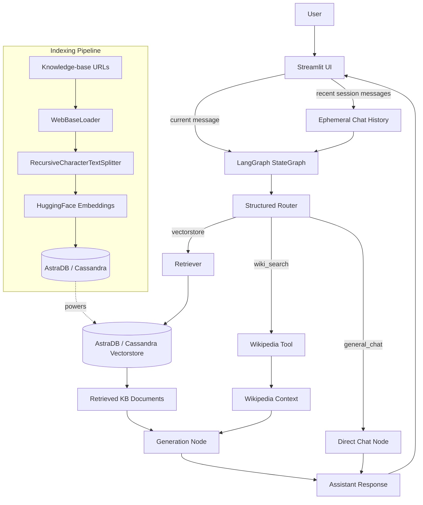
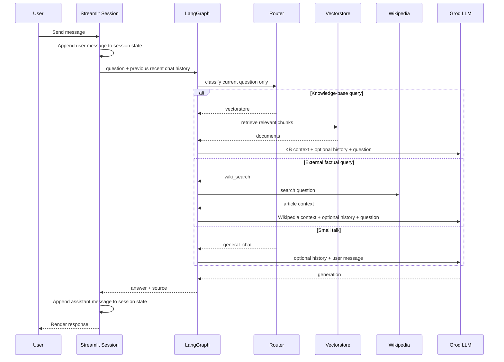
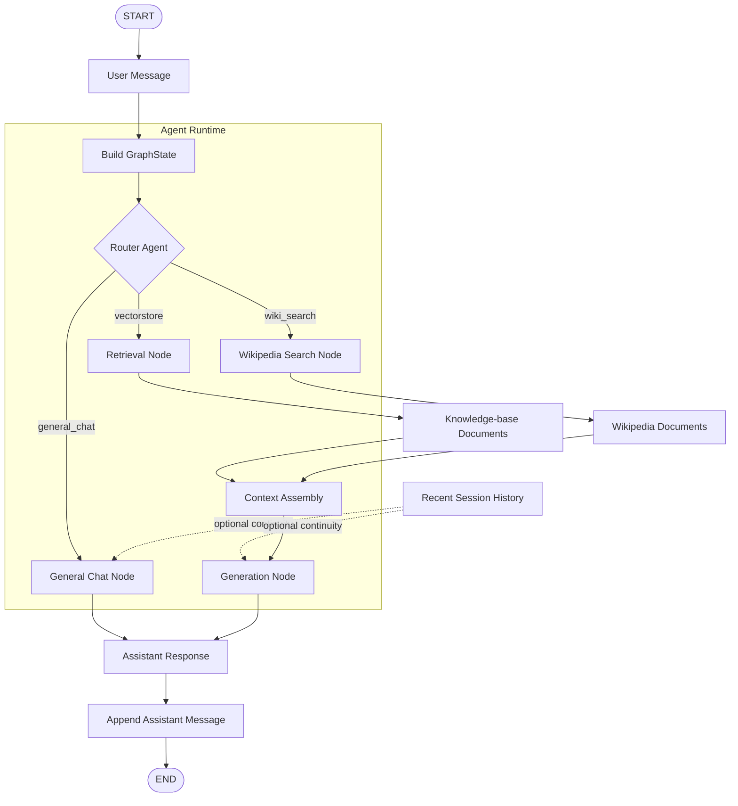
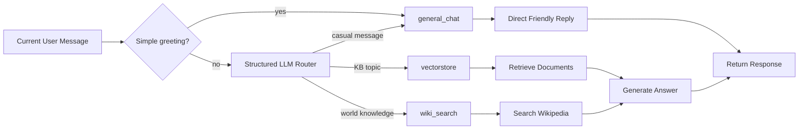
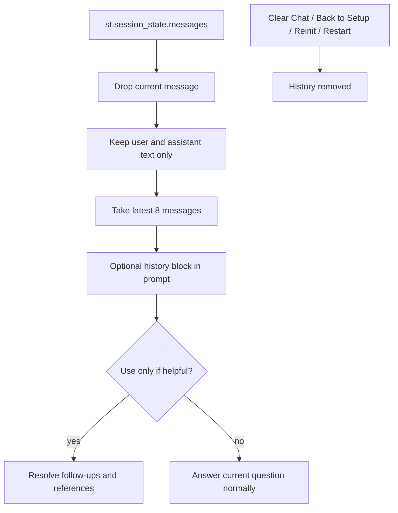
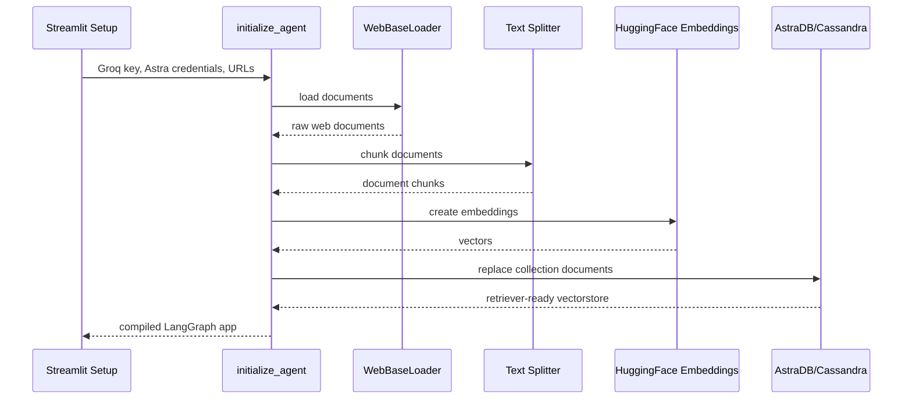

# Agentic RAG System

An agentic retrieval-augmented chat system that routes each user message to the right execution path, retrieves context when needed, and answers through a LangGraph-orchestrated workflow.

The app combines LangGraph, LangChain, Groq, AstraDB/Cassandra, Streamlit, HuggingFace embeddings, and Wikipedia search. It now also supports lightweight in-session chat memory, so follow-up questions can use recent conversation context without changing the routing decision or persisting anything after restart.

---

## Key Features

### Intelligent Multi-Source Routing

Incoming messages are classified into one of three paths:

- `vectorstore` for questions covered by the configured knowledge-base URLs.
- `wiki_search` for factual or encyclopedic questions outside the knowledge base.
- `general_chat` for greetings, thanks, casual conversation, and other small-talk messages.

Routing is based on the current user message only, keeping tool selection predictable and avoiding history-driven misrouting.

### Session-Only Conversational Context

The Streamlit session keeps recent chat turns in memory and passes a short history window to the answer-generation prompts. The model can use this only when it clearly helps with references, follow-up wording, or session preferences.

This memory is intentionally ephemeral:

- cleared by the Clear Chat button,
- cleared when returning to setup or reinitializing,
- lost when the app/session restarts,
- never written to AstraDB or disk.

### Graph-Orchestrated Agent Workflow

The core runtime is a compiled LangGraph `StateGraph`. Each node has a clear job: route, retrieve/search, assemble context, or generate an answer.

### Semantic Vector Retrieval Pipeline

The ingestion pipeline:

- loads configured web pages,
- splits them into semantic chunks,
- embeds chunks with `sentence-transformers/all-MiniLM-L6-v2`,
- stores vectors in AstraDB/Cassandra,
- exposes a retriever for query-time similarity search.

### Grounded LLM Generation

Retrieved context is placed above the user question in a constrained prompt. For knowledge-base answers, the model is instructed to answer from the provided context and say it does not know when the context is insufficient.

### Streamlit Runtime UI

The UI supports:

- credential setup from fields or `.env` upload,
- dynamic knowledge-base URL configuration,
- agent initialization,
- chat rendering,
- routing-source labels,
- in-session message history.

---

## System Architecture



---

## Runtime Workflow



---

## Agent Workflow Graph



This graph shows the agent's internal execution path: routing happens first, tool/context work happens only when needed, and recent chat history is added as optional prompt context after routing.

`general_chat` intentionally bypasses context assembly because it does not retrieve documents. It uses the current message plus optional recent session history and returns a direct friendly response.

---

## Query Routing Logic



Routing deliberately ignores chat history. History is only added later inside answer prompts, where it can help with continuity but cannot steer datasource selection.

---

## Session Memory Design



The memory layer is intentionally small and conservative. It improves questions like "explain that in simpler words" or "give me an example of the second one" while preserving the current-question-first behavior of the agent.

---

## Ingestion Workflow



---

## Core Modules

| File | Responsibility |
| --- | --- |
| `app.py` | Streamlit UI, setup flow, chat rendering, session message storage, graph invocation |
| `agent.py` | High-level initialization of vectorstore, retriever, router, wiki tool, and graph |
| `graph.py` | LangGraph state, routing edges, retrieval/search nodes, chat node, generation prompts |
| `router.py` | Structured query classification with `vectorstore`, `wiki_search`, and `general_chat` labels |
| `vectorstore.py` | URL loading, chunking, embeddings, AstraDB/Cassandra lifecycle, retriever setup |
| `wiki_tool.py` | Wikipedia retrieval tool creation |
| `ui.py` | Streamlit styling and reusable UI rendering helpers |
| `requirements.txt` | Python dependency list |

---

## State Model

The graph passes a typed state object between nodes:

```text
GraphState
├── question       current user message
├── generation     final assistant output when available
├── documents      retrieved LangChain documents
├── source         selected response source
└── chat_history   recent in-session messages for optional continuity
```

The `source` field is used by the UI to label the response path. The `chat_history` field is not persistent memory; it is a small prompt helper.

---

## Tech Stack

| Category | Technologies | Purpose |
| --- | --- | --- |
| App | Python, Streamlit | Local interactive chat UI |
| Orchestration | LangGraph | Stateful graph workflow |
| AI Framework | LangChain | Retrievers, tools, prompts, documents |
| LLM | Groq, Llama 3.1 8B Instant | Routing and answer generation |
| Vector Data | AstraDB, Cassandra | Managed vector storage |
| Embeddings | HuggingFace, Sentence Transformers | Semantic chunk embeddings |
| External Knowledge | Wikipedia API Wrapper | Factual fallback retrieval |
| Config | `.env`, Streamlit inputs | Runtime credentials and URL setup |

---

## Repository Structure

```text
project/
├── app.py
├── agent.py
├── graph.py
├── router.py
├── vectorstore.py
├── wiki_tool.py
├── ui.py
├── requirements.txt
└── README.md
```

---

## Setup & Installation

### 1. Clone Repository

```bash
git clone <repository_url>
cd <repository_name>
```

### 2. Create Virtual Environment

```bash
python -m venv .venv
```

macOS / Linux:

```bash
source .venv/bin/activate
```

Windows:

```bash
.venv\Scripts\activate
```

### 3. Install Dependencies

```bash
pip install -r requirements.txt
```

### 4. Configure Credentials

You need:

- Groq API key
- AstraDB token
- AstraDB database ID

You can enter them in the UI or upload a `.env` file containing:

```bash
GROQ_API_KEY=...
ASTRA_DB_TOKEN=...
ASTRA_DB_ID=...
```

### 5. Run Application

```bash
streamlit run app.py
```

---

## Default Knowledge Base

The app starts with three example URLs from Lilian Weng's blog:

- LLM-powered autonomous agents
- Prompt engineering
- Adversarial attacks on LLMs

You can replace these with any valid HTTP/HTTPS URLs during setup. Reinitializing rebuilds the current AstraDB vector collection for the active configuration.

---

## Design Notes

### Why Use LangGraph?

The app is not a single prompt wrapper. LangGraph makes each branch explicit and keeps state transitions inspectable:

```text
message -> route -> retrieve/search/chat -> generate -> response
```

This makes the workflow easier to test, debug, and extend.

### Why Keep Memory Ephemeral?

The current memory layer is designed for conversational usefulness, not user profiling. It gives the assistant enough context to answer follow-ups naturally while avoiding persistence, database schema changes, privacy surprises, or history-based routing drift.

### Why Separate Routing From Generation?

Routing decides where evidence should come from. Generation decides how to answer. Keeping those responsibilities separate prevents previous chat turns from accidentally pushing the agent toward the wrong retrieval path.

---

## Future Roadmap

### Hybrid Retrieval Fusion

Combine vector similarity retrieval with external search retrieval using confidence-weighted ranking and reranking pipelines.

### Persistent Memory Options

Add opt-in persistent memory with user/session isolation, retention controls, and clear privacy boundaries.

### FastAPI Backend

Move the graph runtime behind a FastAPI service for React, Flutter, or mobile integration.

### Observability & Evaluation

Add tracing, token analytics, retrieval scoring, and automated RAG evaluation tests.

### Retrieval Guardrails

Add source attribution, retrieval validation, hallucination checks, and answer confidence signals.

---

## Why This Project Matters

This repository demonstrates practical engineering patterns used in modern AI systems:

- retrieval-augmented generation,
- graph-based orchestration,
- structured LLM routing,
- ephemeral conversational context,
- semantic retrieval pipelines,
- tool-backed answer generation,
- modular AI workflow design.

It shows how production-style AI applications move beyond simple prompting into orchestrated, stateful, tool-enabled systems.
